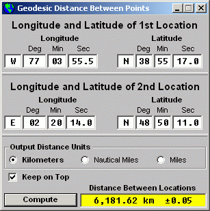



## Geo\_Dist\_v2

### Description

 PROGRAM NAME: Geo_Dist 

VERSION: v2.0 

PURPOSE & DESCRIPTION  

This program computes the geodesic surface distance between two locations on the surface of the Earth to an accuracy of about ±50 meters.

  

Instead of assuming the Earth to be a perfect sphere, this program takes into account the actual polar flattening of the earth and the

equatorial bulge, which gives a much more accurate computation between the given coordinates.  

The coordinates arguments are given in degrees minutes and seconds and the computed distance may be returned in kilometers, statute miles or nautical miles.

  
 
### More Info
 
Latitude and longitude of any two locations.

Distance between the two locations in kilimeters, statute miles or nautical miles.

             |
---                |---
**Submitted On**   |2001-01-30 19:02:28
**By**             |[Jay Tanner](https://github.com/Planet-Source-Code/PSCIndex/blob/master/ByAuthor/jay-tanner.md)
**Level**          |Advanced
**User Rating**    |4.7 (14 globes from 3 users)
**Compatibility**  |VB 6\.0
**Category**       |[Math/ Dates](https://github.com/Planet-Source-Code/PSCIndex/blob/master/ByCategory/math-dates__1-37.md)
**World**          |[Visual Basic](https://github.com/Planet-Source-Code/PSCIndex/blob/master/ByWorld/visual-basic.md)
**Archive File**   |[CODE\_UPLOAD143471302001\.zip](https://github.com/Planet-Source-Code/jay-tanner-geo-dist-v2__1-14854/archive/master.zip)

